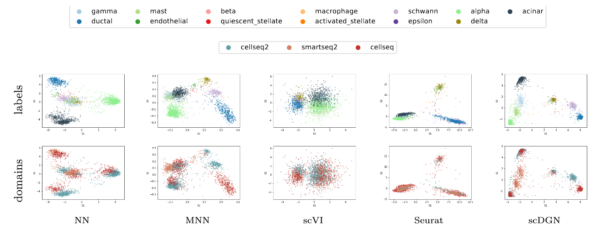

# Supervised Adversarial Alignment of Single-Cell RNA-seq Data

The scDGN model aims at reducing dimensionality for scRNA data with a kind taking care of the batch effects under supervised setting.

## Pre-requisites
* PyTorch
* NumPy
* Scipy

## Network Architecture

Architecture of scDGN. The network includes three modules: scRNA encoder $f_e$ (blue), label classifier $f_l$ (orange) and domain discriminator $f_d$ (red). Note that the red and orange networks use the same encoding as input. Solid lines represent the forward direction of the neural network while the dashed lines represent the backpropagation direction with the corresponding gradient it passes. Gradient Reversal Layers (GRL) have no effect in forward propagation, but flip the sign of the gradients that flow through them during backpropagation. This allows the combined network to simultaneously optimize label classification and attempt to ``fool" the domain discriminator. Thus, the encoder leads to representations that are invariant to the different domains while still distinguishing cell types.


## Preparation 

First, create the enviroment with Anaconda. Installing Pytorch with the other versions of CUDA can be found at [Pytorch document](https://pytorch.org/get-started/previous-versions/). Here PyTorch 3.1.0 and CUDA 9.0 are used:
```
  mkdir scDGN scDGN/data scDGN/ckpts
  cd scDGN
  git clone git@github.com:SongweiGe/scDGN.git
  conda create -n scDGN python=3.6
  conda activate scDGN
  conda install pytorch=1.301 cuda90 -c pytorch
```

Then download the `data/` folder from the link https://drive.google.com/open?id=1_2XN9GNBW7458o_4nrzaQ838UEoxUU7V to directory `DeepVote/data/`. 

## Usage

### Training
Change the `exp_name` to whatever you want to call. Also see train_DeepVote.py to adjust hyper-parameters (for eg. change `n_folds` to set the folds number in cross validation experiments). See model_util.py for other variants of Deep Vote model to replace `model` option.
```
python train_DeepVote.py --model base --exp_name base_dv --gpu_id 0 > logs/base_dv_cross_validation.txt
```

### Inference
After training the model, you can use it to fuse any BSM results using the following command. For example, you can download our trained model to `../results/base_dv/models/base_all` and use it to rectify the arbitrary number of images in folder indicated by `input`. The results will be saved under `reconstruction` folder of the corresponding `exp_name` folder.
```
python infer.py --model base --exp_name base_dv --model_name base_all --gpu_id 0 --n_pair 5 --input ../data/MVS/dem_6_18 
```

### Evaluation
For inferring and visualizing the representations for NN and scDGN models. Please refer to Jupyter Notebook PCA_visualization.ipynb.



For selecting the important genes identified by the models Please refer to Jupyter Notebook feature_importance.ipynb.
